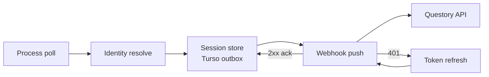

<div align="center">
  <a href="https://github.com/Questory-Labs/qMonitor">
    
  </a>

  <h1 align="center">qMonitor</h1>
  <h6 align="center">
    — by QuestoryLabs
  </h6>

  <p align="center">
    <strong>Desktop game-session monitor for Questory.</strong><br/>
    Watches what’s running, figures out <em>which</em> game it is,<br/>
    stores sessions locally, and pushes completed playtime to your Questory instance.
  </p>

  <p align="center">
    <a href="https://github.com/Questory-Labs/qMonitor/releases"></a>
    <a href="https://github.com/Questory-Labs/Questory"></a>
    <a href="https://questory-labs.github.io/"></a>
  </p>

  <p align="center">
    
    
    
    
    
    <a href="./LICENSE"></a>
  </p>
</div>

<br/>

## ✨ Features

- 🎮 **Steam-first identity** — AppID ground truth via launch reaper + local library index.
- 🔎 **Discord detectable catalog** — cached locally, refreshed daily (URL overridable in Settings).
- 📚 **Local catalog + confirm** — custom titles and user-confirmed non-Steam games.
- 📤 **Reliable outbox** — embedded Turso DB with retry, ack, and retention purge (7 or 30 days).
- 🔐 **Device login** — auth code + PKCE, device-bound refresh to your Questory instance.
- 🖥️ **Tray-friendly UI** — compact Home / Games / Settings; optional minimize/close-to-tray and start-at-login.

---

## 🏗️ How it works

qMonitor sits in the background (or the tray), polls running processes, and resolves each match through a Steam-first identity pipeline:

1. **Steam AppID** — launch reaper + local library index when Steam is the source of truth
2. **Discord detectable catalog** — cached locally, refreshed daily (URL overridable)
3. **Local catalog + confirm** — custom titles and user-confirmed non-Steam games

Completed sessions land in a local outbox DB, then sync to Questory via webhook with retry, ack, and retention purge.



---

## 🛠️ Technology Stack

| Domain | Technologies |
| :--- | :--- |
| **UI** | Tauri 2 + React (Home / Games / Settings) |
| **Core** | Rust — process detect, identity, auth, push, DB |
| **Data** | Embedded [Turso](https://github.com/tursodatabase/turso) outbox |
| **Auth** | Device login (PKCE) + OS keyring for tokens |
| **Platforms** | Windows (NSIS + MSI) · Linux (AppImage + `.deb` + Arch) |

---

## 🚀 Quick Start

### Prerequisites

- [Node.js 20+](https://nodejs.org/) and [pnpm](https://pnpm.io/)
- [Rust](https://rustup.rs/) stable toolchain
- [Tauri 2 prerequisites](https://v2.tauri.app/start/prerequisites/) for your OS

### Develop

```bash
pnpm install
pnpm tauri dev
```

Useful aliases: `pnpm tauri:dev` · frontend-only Vite: `pnpm dev` (port `1420`).

### Build

```bash
pnpm tauri build
```

Bundles (see `src-tauri/tauri.conf.json`):

| Platform | Artifacts |
| :--- | :--- |
| **Windows** | NSIS (`*-setup.exe`) + MSI (`currentUser` install) |
| **Linux** | AppImage + `.deb` |
| **Arch** | `.pkg.tar.zst` (CI repackages the `.deb`; see `packaging/arch/`) |

---

## 📦 Releases

GitHub Actions publishes installers automatically:

| Channel | Trigger | Tag / name |
| :--- | :--- | :--- |
| **Stable** | Merge / push to `release` | Immutable `v{version}` from `package.json` only — bump that file; `Cargo.toml` / `tauri.conf.json` sync at build. GitHub **Latest** is a badge, not a reused tag. |
| **Canary** | Merge / push to `main` | Immutable prerelease `v{version}-canary.{shortsha}` (`prerelease`, not Latest). Previous canaries stay on Releases. |

Download from the repo **[Releases](https://github.com/Questory-Labs/qMonitor/releases)** page. In the app, **Settings → Updates** checks that channel once per day and offers a link to the matching tag (no auto-install). Arch example:

```bash
sudo pacman -U qmonitor-*.pkg.tar.zst
```

> 💡 **Tip:** PRs run CI (frontend build + `cargo test`) only; they do not publish artifacts.

---

## ⚙️ First-run setup

1. Open **Settings** and set your Questory **base URL** (web origin like `https://app…` or API origin like `https://api…`).
2. Save — qMonitor probes `{baseUrl}/api/health`, detects `fe` vs `be`, and stores `apiRoot` / `webOrigin`.
3. **Sign in** with device login (browser consent + loopback callback).
4. Optionally point at a local game catalog and tweak tray / retention prefs.

Config lives under the OS config dir:

| OS | Path |
| :--- | :--- |
| **Windows** | `%APPDATA%\qMonitor` |
| **Linux** | `~/.config/qMonitor` |

Tokens use the OS keyring (`access_token` + refresh as `session_token`). Device id is derived from a hashed install salt (`device_salt` in the config dir). Settings → **Dev token** is a local override for webhook pushes only.

See [`config.example.json`](config.example.json) for the full shape:

| Key | Default | Notes |
| :--- | :--- | :--- |
| `baseUrl` | — | Questory web or API origin |
| `pollIntervalSecs` | `3` | Process poll cadence |
| `retentionAckedDays` | `30` | Synced-row purge (`7` or `30`) |
| `catalogPath` | — | Path to local catalog JSON |
| `detectableUrl` | Discord v10 detectable | Cached as `detectable.json` |
| `steamPathOverride` | — | Non-default Steam install |
| `dbPath` | `qmonitor.db` in config dir | Local Turso file |
| `startAtLogin` / `minimizeToTray` / `closeToTray` | `false` | Autostart & tray behavior |

### Local catalog

For titles that Steam / Discord don’t pick up, use a JSON catalog (example: [`catalogs/games.example.json`](catalogs/games.example.json)):

```json
[
  {
    "id": "local:hades",
    "name": "Hades",
    "executables": [
      { "os": "windows", "name": "Hades.exe", "is_launcher": false },
      { "os": "linux", "name": "Hades", "is_launcher": false }
    ],
    "path_hints": ["Hades"],
    "arguments": null
  }
]
```

Point `catalogPath` at that file (or add titles from the Games UI).

---

## 📂 Project layout

```text
qMonitor/
├── src/                 # React UI (Home / Games / Settings)
├── src-tauri/           # Rust core: detect, identity, auth, push, DB
├── packaging/arch/      # PKGBUILD for Arch (.pkg.tar.zst / future AUR)
├── catalogs/            # Example local game catalog
└── config.example.json  # Config shape reference
```

---

## 🔌 Webhook & auth

<details>
<summary><strong>Click to view webhook payload and OAuth paths</strong></summary>

`POST {apiRoot}/webhooks/qmonitor`  
`Authorization: Bearer <accessToken>`

```json
{
  "schema_version": 1,
  "session_id": "uuid",
  "source": "steam",
  "steam_app_id": 570,
  "title": "Dota 2",
  "exe": "dota2.exe",
  "started_at": "...",
  "ended_at": "...",
  "duration_secs": 4500,
  "host": { "os": "windows", "hostname": "..." }
}
```

- **HTTP 2xx** → session acked in the outbox
- **401** → refresh with `device_id` + refresh token, then retry

OAuth paths (relative to the resolved API/web origins): `/oauth/qmonitor/authorize`, `/oauth/qmonitor/token`, `/oauth/qmonitor/revoke`.

</details>

---

## 📝 License

This project is distributed under the **MIT** License.
See [LICENSE](LICENSE) for details.

[MIT](LICENSE) © Questory Labs
