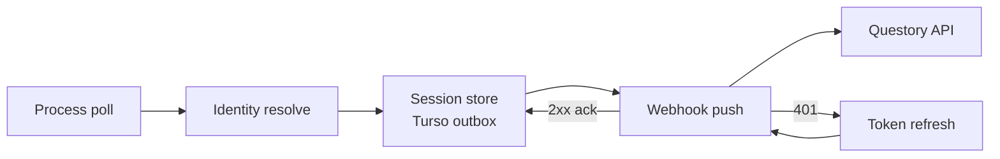

# qMonitor

**Desktop game-session monitor for Questory.** Watches what’s running, figures out *which* game it is, stores sessions locally, and pushes completed playtime to your Questory instance.

Windows + Linux · Tauri 2 + React · embedded [Turso](https://github.com/tursodatabase/turso) · MIT

---

## What it does

qMonitor sits in the background (or the tray), polls running processes, and resolves each match through a Steam-first identity pipeline:

1. **Steam AppID** — launch reaper + local library index when Steam is the source of truth  
2. **Discord detectable catalog** — cached locally, refreshed daily (URL overridable)  
3. **Local catalog + confirm** — custom titles and user-confirmed non-Steam games  

Completed sessions land in a local outbox DB, then sync to Questory via webhook with retry, ack, and retention purge.



## Features

| Area | Details |
|------|---------|
| **UI** | Compact Home / Games / Settings app (Tauri 2 + React) |
| **Tray** | System tray, optional minimize/close-to-tray, start-at-login |
| **Steam** | AppID ground truth via launch reaper + library index |
| **Detectable** | Discord catalog cache (startup + every 24h); custom URL in Settings |
| **Catalog** | JSON local catalog + in-app confirm for titles Steam/Discord miss |
| **Outbox** | Embedded Turso DB with retry / ack / retention (7 or 30 days) |
| **Auth** | Device login to Questory (auth code + PKCE, device-bound refresh) |

## Requirements

- **Node** 20+ and **pnpm**
- **Rust** stable toolchain
- [Tauri 2 prerequisites](https://v2.tauri.app/start/prerequisites/) for your OS

## Develop

```bash
pnpm install
pnpm tauri dev
```

Useful aliases: `pnpm tauri:dev` · frontend-only Vite: `pnpm dev` (port `1420`).

## Build

```bash
pnpm tauri build
```

Bundles (see `src-tauri/tauri.conf.json`):

| Platform | Artifacts |
|----------|-----------|
| Windows | NSIS (`*-setup.exe`) + MSI (`currentUser` install) |
| Linux | AppImage + `.deb` |
| Arch | `.pkg.tar.zst` (CI repackages the `.deb`; see `packaging/arch/`) |

### Releases

GitHub Actions publishes installers automatically:

| Channel | Trigger | Tag / name |
|---------|---------|------------|
| **Stable** | Merge / push to `release` | `v{version}` from `package.json` only — bump that file; `Cargo.toml` / `tauri.conf.json` sync at build |
| **Canary** | Merge / push to `main` | Rolling prerelease `canary` — version `{version}-canary.{shortsha}` |

Download from the repo **Releases** page. Arch example:

```bash
sudo pacman -U qmonitor-*.pkg.tar.zst
```

PRs run CI (frontend build + `cargo test`) only; they do not publish artifacts.

## First-run setup

1. Open **Settings** and set your Questory **base URL** (web origin like `https://app…` or API origin like `https://api…`).
2. Save — qMonitor probes `{baseUrl}/api/health`, detects `fe` vs `be`, and stores `apiRoot` / `webOrigin`.
3. **Sign in** with device login (browser consent + loopback callback).
4. Optionally point at a local game catalog and tweak tray / retention prefs.

Config lives under the OS config dir:

| OS | Path |
|----|------|
| Windows | `%APPDATA%\qMonitor` |
| Linux | `~/.config/qMonitor` |

Tokens use the OS keyring (`access_token` + refresh as `session_token`). Device id is derived from a hashed install salt (`device_salt` in the config dir). Settings → **Dev token** is a local override for webhook pushes only.

See [`config.example.json`](config.example.json) for the full shape (defaults shown below).

| Key | Default | Notes |
|-----|---------|--------|
| `baseUrl` | — | Questory web or API origin |
| `pollIntervalSecs` | `3` | Process poll cadence |
| `retentionAckedDays` | `30` | Synced-row purge (`7` or `30`) |
| `catalogPath` | — | Path to local catalog JSON |
| `detectableUrl` | Discord v10 detectable | Cached as `detectable.json` |
| `steamPathOverride` | — | Non-default Steam install |
| `dbPath` | `qmonitor.db` in config dir | Local Turso file |
| `startAtLogin` / `minimizeToTray` / `closeToTray` | `false` | Autostart & tray behavior |

## Local catalog

For titles that Steam / Discord don’t pick up, use a JSON catalog (example: [`catalogs/games.example.json`](catalogs/games.example.json)):

```json
[
  {
    "id": "local:hades",
    "name": "Hades",
    "executables": [
      { "os": "windows", "name": "Hades.exe", "is_launcher": false },
      { "os": "linux", "name": "Hades", "is_launcher": false }
    ],
    "path_hints": ["Hades"],
    "arguments": null
  }
]
```

Point `catalogPath` at that file (or add titles from the Games UI).

## Webhook payload

`POST {apiRoot}/webhooks/qmonitor`  
`Authorization: Bearer <accessToken>`

```json
{
  "schema_version": 1,
  "session_id": "uuid",
  "source": "steam",
  "steam_app_id": 570,
  "title": "Dota 2",
  "exe": "dota2.exe",
  "started_at": "...",
  "ended_at": "...",
  "duration_secs": 4500,
  "host": { "os": "windows", "hostname": "..." }
}
```

- **HTTP 2xx** → session acked in the outbox  
- **401** → refresh with `device_id` + refresh token, then retry  

OAuth paths (relative to the resolved API/web origins): `/oauth/qmonitor/authorize`, `/oauth/qmonitor/token`, `/oauth/qmonitor/revoke`.

## Project layout

```
qMonitor/
├── src/                 # React UI (Home / Games / Settings)
├── src-tauri/           # Rust core: detect, identity, auth, push, DB
├── packaging/arch/      # PKGBUILD for Arch (.pkg.tar.zst / future AUR)
├── catalogs/            # Example local game catalog
└── config.example.json  # Config shape reference
```

## License

[MIT](LICENSE) © Questory Labs
